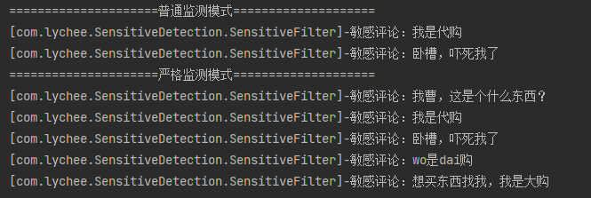

# DFA-SensitiveDetection
中文敏感词检测加强版，针对OOV问题，能够检测出敏感词的同音词

## 特点
* 通用DFA算法检测敏感词
* 可检测出词库中敏感词对应的同音(可不同调)疑似敏感词(OOV)
* 可解析疑似敏感词中的多音字，即疑似敏感词中有部分为多音字，当其中某个音参与疑似敏感词时，也可被检测
* 可检测出以拼音替换敏感词中汉字的情况

## 效果演示
测试文本分别为："我曹，这是个什么东西？" "我是代购" "卧槽，吓死我了"

敏感词："卧槽" "代购"

疑似敏感词："我曹"

## 关于项目中的词库来源
词库均来源于互联网免费下载连接
